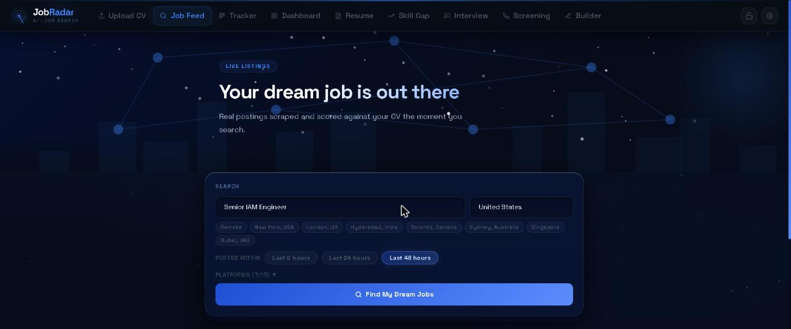
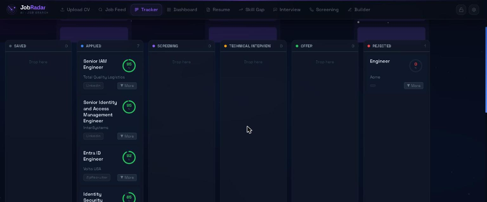
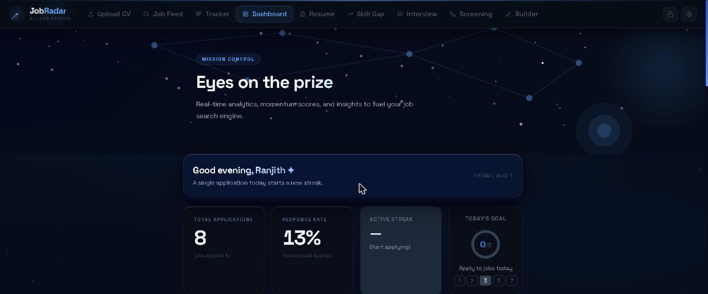
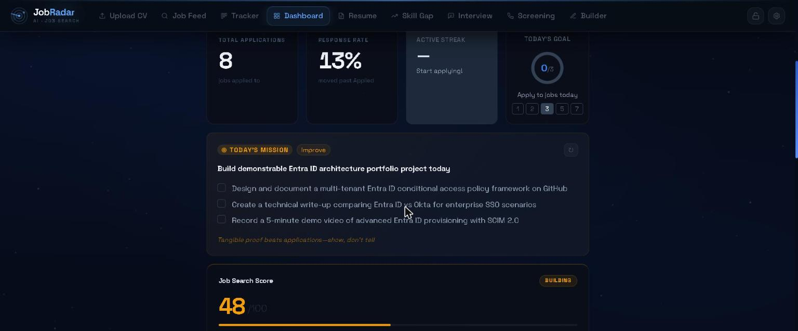
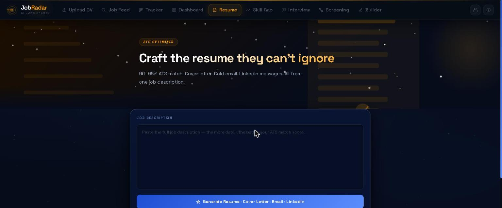
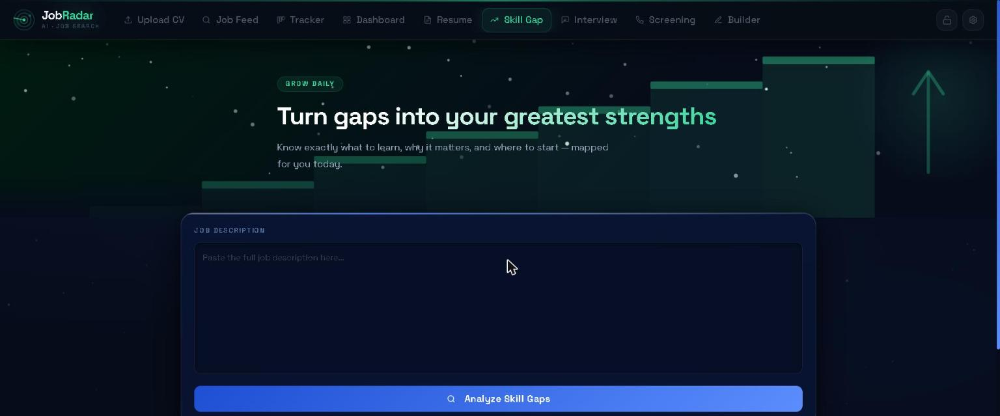
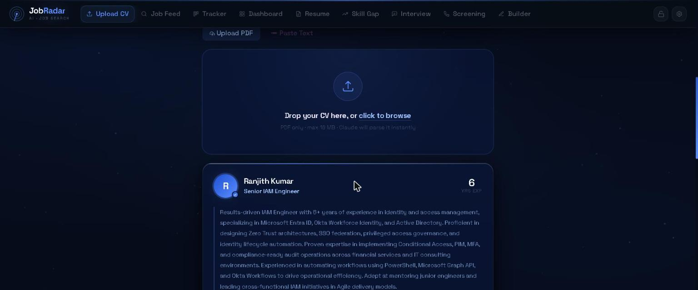
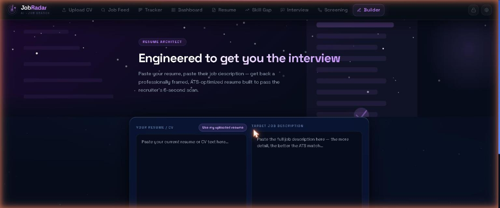

<div align="center">


# 🎯 JobRadar

### AI-Powered Job Search & Resume Tailoring Platform

*Search jobs across every major board, get your resume tailored to each JD in seconds, and track your entire pipeline — all in one dark-mode app.*

**9 integrated modules · 7 job boards unified into one search · 2 AI models routed by task · designed, built, and used solo, end-to-end**

</div>

---

## Screenshots

<table>
<tr>
<td width="50%"><br/><sub><b>Job Feed</b> — live listings scraped and scored against your CV the moment you search</sub></td>
<td width="50%"><br/><sub><b>Tracker</b> — drag-and-drop kanban pipeline from Applied to Offer</sub></td>
</tr>
<tr>
<td width="50%"><br/><sub><b>Dashboard</b> — real-time application stats, response rate, and streaks</sub></td>
<td width="50%"><br/><sub><b>Today's Mission</b> — Claude-generated daily action plan and job search score</sub></td>
</tr>
<tr>
<td width="50%"><br/><sub><b>Resume Generator</b> — paste a JD, get an ATS-optimized resume, cover letter, and outreach messages</sub></td>
<td width="50%"><br/><sub><b>Skill Gap Analyzer</b> — see exactly what to learn next and why it matters</sub></td>
</tr>
<tr>
<td width="50%"><br/><sub><b>Upload CV</b> — drop a PDF and Claude parses your experience instantly</sub></td>
<td width="50%"><br/><sub><b>Resume Builder Pro</b> — paste any resume + JD, no saved profile required</sub></td>
</tr>
</table>

---

## Why I Built This

I built JobRadar while running my own job search as an IAM engineer, after realizing I was losing more time to copy-pasting job descriptions across a dozen browser tabs and reformatting the same resume than I was spending preparing for actual interviews. So I built the tool I wished existed — not a weekend script, but a real system: concurrent scraping, an AI content pipeline with model routing, pixel-precision PDF generation verified down to individual character positions, and a data layer that never loses your history.

Every screenshot in this README is the live app, running on my own data. I'm still using it every day.

---

## The Problem

Job searching in 2026 is broken in a very specific way: the volume of applications you need to send to get an offer has gone up, while the time you have to make each one good has gone down.

- **ATS filters reject you before a human sees your resume** if it doesn't mirror the job description's language closely enough — but manually re-tailoring a resume for every posting takes 30–60 minutes, so most people either send one generic resume everywhere (and get auto-filtered) or burn out after a dozen applications.
- **The search itself is fragmented** across LinkedIn, Indeed, Glassdoor, Wellfound, Dice, and more — each with its own filters, none of which know what's actually in your resume.
- **Pipelines die in spreadsheets.** Once you're tracking 20+ applications across different stages, most people lose the thread on what's outstanding, what needs a follow-up, and what's working.
- **Rejections are silent.** You rarely learn *why* you didn't advance, so the same gaps quietly repeat across every application.

## The Solution

JobRadar is an end-to-end job search platform that replaces that whole fragmented workflow with one system: it searches for you, scores what it finds against your real background, rewrites your resume to match each role well enough to pass ATS *and* impress the human reading it next, and keeps the entire pipeline visible in one place so nothing falls through the cracks. Flask + Claude AI on the backend, a single-file React frontend — nine tools that all feed the same underlying profile instead of nine disconnected features.

---

## Features

**Job Feed** — one search, every board
- Scrapes LinkedIn, Indeed, Glassdoor, Google Jobs, ZipRecruiter, Wellfound, and Dice concurrently via Apify (parallelized with a thread pool instead of hitting each board sequentially)
- Smart 72-hour → 7-day auto-fallback window so a narrow search never comes back empty
- Every result is auto-scored against your real CV by Claude before you ever see it

**Resume Generator & Resume Builder Pro** — the core engine
- Paste any JD → get back an ATS-optimized resume (90–95% keyword match), a tailored cover letter, a cold outreach email, a LinkedIn connection note, and an InMail-ready LinkedIn message — from one job description
- PDF layout is engineered for pixel-level precision: fixed-width table columns guarantee bullet and skills-list alignment survive text wrapping, margins and type scale are matched to a professional reference resume and verified character-by-character with PyMuPDF
- The skills section is curated per role, not just appended to — the model actively drops irrelevant skills and surfaces the ones that actually matter for that JD instead of producing a bloated, unfocused list
- Every summary opens on that candidate's single strongest, most specific credential instead of a repeating template — no two resumes read alike
- Builder Pro runs the identical pipeline against any pasted resume + JD with no saved profile required

**Skill Gap Analyzer**
- Compares your real background against a target JD and maps exactly what to learn next, why it matters for that specific role, and where to start

**Interview Prep & Screening Call Coach**
- Generates likely interview questions and a screening-call script tailored to the specific role and company

**Job Tracker**
- Kanban board: Saved → Applied → Screening → Technical Interview → Offer → Rejected
- Drag cards across stages; every card carries its match score, source platform, and date posted

**Dashboard**
- Real-time funnel stats, response rate, and application streaks
- A Claude-generated "Today's Mission" — a concrete daily action plan (not just "apply to more jobs") and a running Job Search Score that weights application volume, match quality, and response rate

**Settings**
- Paste your Anthropic and Apify API keys directly in the UI — no terminal config needed
- Keys saved to a local `.env` file

---

## Engineering Highlights

A few details that mattered more than they might look from the screenshots:

- **Model routing for cost/latency, not just capability** — fast, cheap `claude-haiku-4-5` handles CV parsing, interview prep, and salary estimation; the heavier `claude-sonnet-4-6` is reserved for resume generation and skill-gap analysis, where reasoning quality actually changes the output.
- **Concurrent scraping** — `fetch_jobs()` runs the multi-board, Wellfound, and Dice scrapers in parallel via `ThreadPoolExecutor` instead of sequentially, while still surfacing per-board failures (and propagating billing/quota errors immediately) without killing the whole search.
- **Resilient LLM JSON parsing** — a lenient JSON repair layer recovers from truncated or malformed model output (closing dangling strings/brackets, trimming incomplete trailing elements) so a single flaky generation doesn't break the pipeline.
- **PDF alignment engineering** — ReportLab's `TA_JUSTIFY` stretches inter-word spaces unpredictably, which breaks any hanging-indent approach to bullet/skills alignment. Fixed by rendering bullets and skills rows as fixed-width table cells instead of indented paragraphs, and verified with PyMuPDF's character-level `rawdict` bounding boxes rather than trusting it visually.
- **Data-safety-first backend** — session boundaries only clear stale, unsaved search results; your CV profile, tracker history, and application data are never wiped by a new browser session or server restart.

---

## Tech Stack

| Layer | Technology |
|-------|-----------|
| Backend | Python 3.10+, Flask 3.0, Flask-SQLAlchemy |
| AI | Anthropic Claude (claude-sonnet-4-6) |
| Job Scraping | Apify — openclawai/job-board-scraper, orgupdate/wellfound-jobs-scraper, shahidirfan/Dice-Job-Scraper |
| PDF Generation | ReportLab 4.0 — pixel-perfect resume & cover letter layout |
| PDF Parsing | PyMuPDF (fitz) |
| Frontend | React 18 (CDN), Tailwind CSS, Chart.js — single-file, no build step |
| Database | SQLite via SQLAlchemy |
| Auth / Config | python-dotenv |

---

## Getting Started

### Prerequisites

- Python 3.10+
- An [Anthropic API key](https://console.anthropic.com/)
- An [Apify API key](https://console.apify.com/account/integrations)

### Installation

```bash
# 1. Clone the repo
git clone https://github.com/Ranjith200228/JobRadar.git
cd JobRadar

# 2. Install dependencies
pip install -r requirements.txt

# 3. Add your API keys (two options)

# Option A — via the app UI (easiest)
#   Run the app, click the ⚙ icon top-right, paste your keys. Done.

# Option B — manual
cp .env.example .env
# Edit .env and fill in:
#   ANTHROPIC_API_KEY=sk-ant-...
#   APIFY_API_KEY=apify_api_...

# 4. Run
python app.py
```

Then open **http://localhost:5000** in your browser.

> **Windows shortcut:** double-click `START_JOBRADAR.bat`

---

## Usage Flow

```
1. Upload CV        →  drop your resume PDF — Claude parses it instantly
2. Job Feed         →  enter role + location, select platforms, hit Fetch
                       Claude auto-scores each result against your CV
3. Resume           →  paste any JD → get resume PDF + cover letter + emails
4. Skill Gap        →  see what to learn before you apply
5. Interview /
   Screening        →  prep questions and a call script for the specific role
6. Tracker          →  drag cards through your pipeline stages
7. Dashboard        →  watch your funnel stats and daily mission update live
```

---

## Project Structure

```
JobRadar/
├── app.py              # Flask backend — all routes, AI calls, PDF generation
├── templates/
│   └── index.html      # React 18 single-page frontend
├── requirements.txt
├── .env.example        # API key template
├── HOW_TO_RUN.txt      # Quick-start guide
├── START_JOBRADAR.bat  # Windows one-click launcher
└── .gitignore          # Excludes db, keys, cache
```

---

## API Keys

| Key | Where to get it |
|-----|----------------|
| `ANTHROPIC_API_KEY` | [console.anthropic.com](https://console.anthropic.com/) |
| `APIFY_API_KEY` | [console.apify.com → Integrations](https://console.apify.com/account/integrations) |

Both keys can be entered through the app's settings panel (⚙ icon) without touching any config files.

---

## Notes

- The SQLite database (`jobradar.db`) is created automatically on first run and is excluded from git
- To start fresh, delete `jobradar.db` and restart the server
- Job scraping runs each board's scraper concurrently, but a full multi-platform search can still take 30–60 seconds depending on Apify response times
- All resume/cover letter PDFs are generated server-side and download directly from the browser

---

## What's Next

JobRadar started as a tool to fix my own workflow, and the roadmap follows the same principle — solve the next real bottleneck, not the next feature that sounds impressive:

- **Response-rate feedback loop** — track which resume phrasing and structure actually correlates with callbacks, and feed that back into generation instead of optimizing on ATS score alone
- **One-click apply** — go from a scored Job Feed result to a submitted application without leaving the tab, once ATS field-mapping is reliable across boards
- **Browser extension** — capture and score any job posting from LinkedIn, a company careers page, or anywhere else, without pasting the JD in manually
- **Multi-user support** — move from a single local profile to real accounts, so this stops being just my tool

---

<div align="center">

Built solo — backend, frontend, AI pipeline, and PDF engine — by [Ranjith Kumar Maddirala](https://github.com/Ranjith200228)

*AI/IAM Engineer building the tools I wish existed*

</div>
